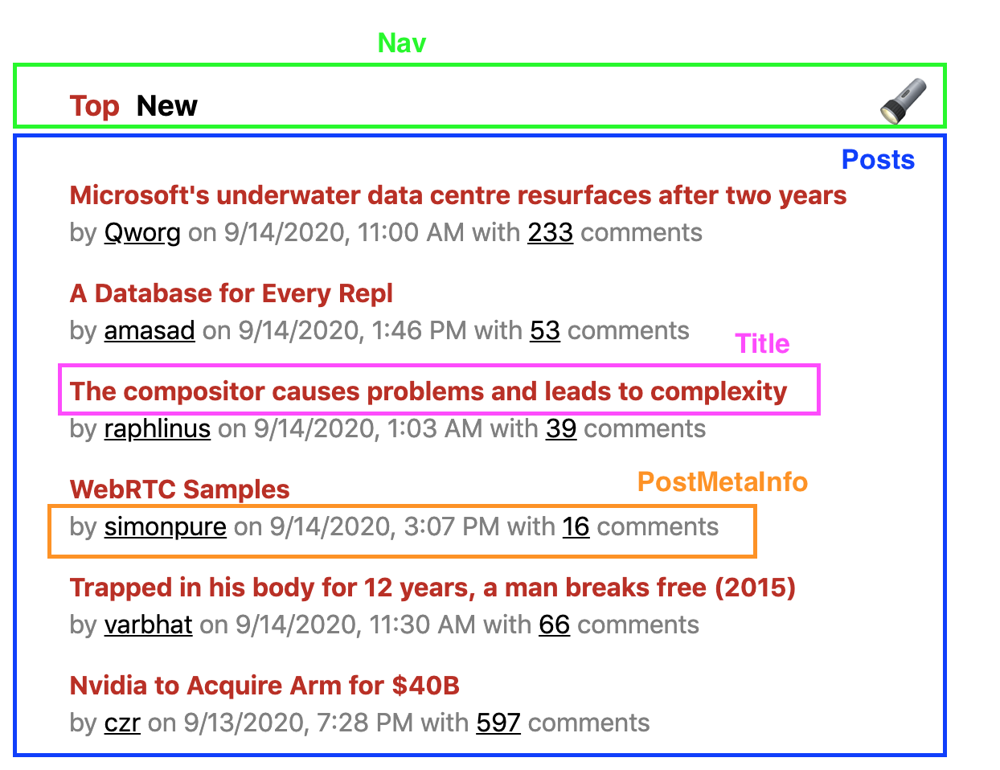
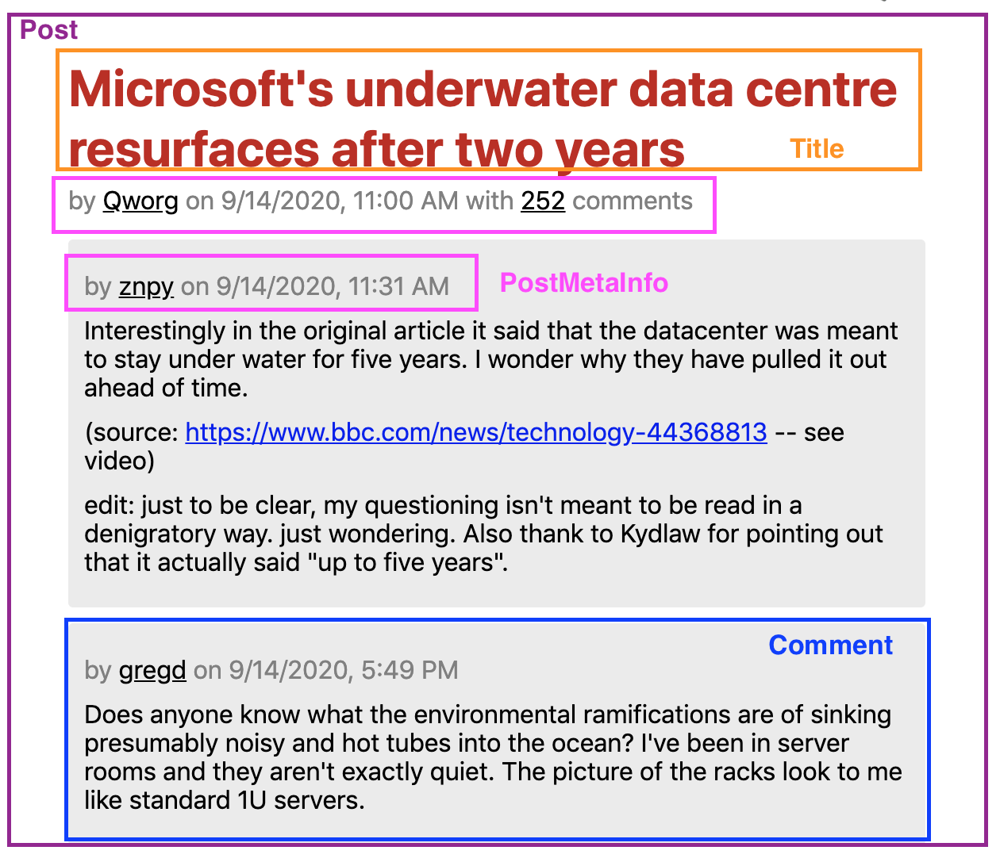
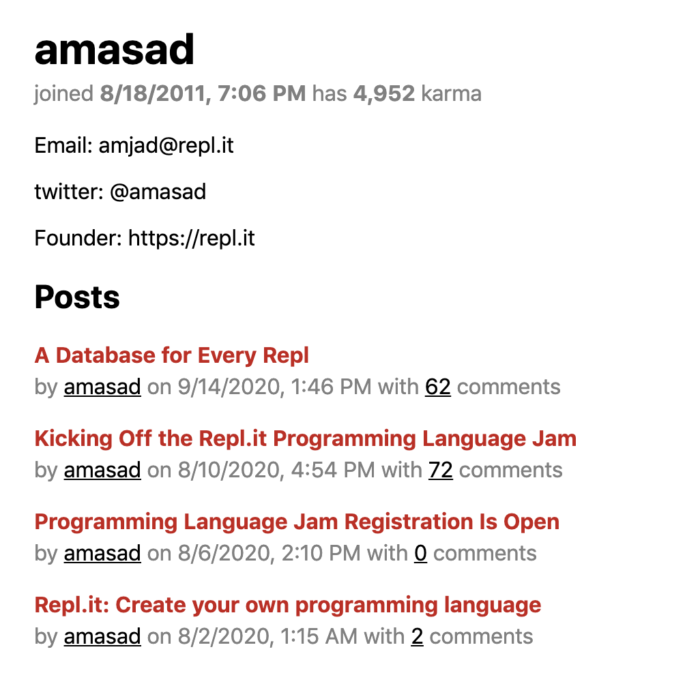
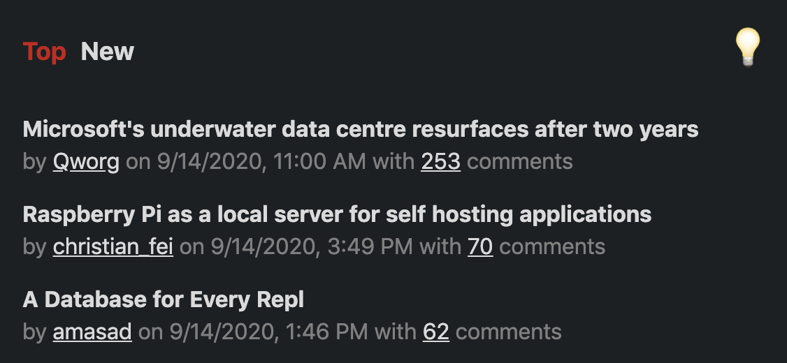

# hacker-news-clone

A soft clone of [Hacker News](https://news.ycombinator.com/) (a read-only version).

[See the finished projet here](https://distracted-lumiere-0aee16.netlify.app/)

[See the API here](https://github.com/HackerNews/API)

## Why

The goal of this project was to become more familiar with React by going
from an API to a static site.

## Components

The Main components are `Posts`, `Post`, and `User`

### Posts
This is the main homepage component that renders the list of links to posts

### Post
This component contains optional Post text and the comments

### User
A users profile

## Contexts

The only context used is one for a light and dark theme
